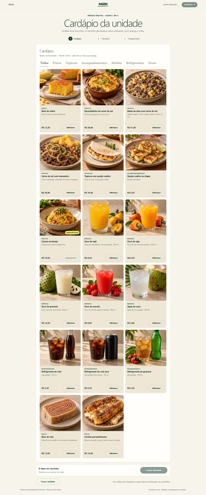

# Raízes do Nordeste

> Protótipo de pedidos digitais e qualidade de software para uma rede de franquias alimentícias.

**React · TypeScript · Node.js · Playwright**

[Abrir demonstração online](https://raizesdonordeste7.vercel.app)

## O projeto

A aplicação demonstra a jornada de pedido, da escolha da unidade ao comprovante. O foco é exercitar regras de negócio e qualidade com testes executáveis e resultados observáveis. Catálogo, fidelidade e pagamento são simulados; nenhum pagamento real é processado.



### Jornada do cliente

1. Escolhe uma unidade disponível.
2. Navega pelo cardápio e ajusta os itens do carrinho.
3. Revisa o pedido e escolhe retirada ou consumo na unidade.
4. Confirma usando o pagamento simulado.
5. Recebe o comprovante com itens, valores e senha de retirada.

| Rota | Tela |
|---|---|
| `/` | Apresentação e escolha da unidade |
| `/cardapio` | Produtos, categorias e carrinho |
| `/checkout` | Resumo, modalidade e pagamento simulado |
| `/comprovante` | Confirmação, itens, total e retirada |
| `/admin` | Painel protegido para analisar pedidos confirmados |

## Tecnologias

| Parte | Tecnologia |
|---|---|
| Interface | React, TypeScript estrito, Vite e CSS |
| API e domínio | Node.js 24, JavaScript ESM e HTTP nativo |
| Testes | `node:test`, Playwright e axe-core |
| Dados externos | Adaptadores simulados; pedidos guardados em memória |

O checkout web envia o canal `WEB` automaticamente. A API também valida outros canais para os cenários de teste.

## Executar localmente

Requisito: Node.js 24 ou superior.

```powershell
npm install
npm run dev
```

Abra `http://127.0.0.1:5173`. A unidade Recife Centro aceita pedidos; Natal Norte fica indisponível para testar o tratamento de falhas.

Para habilitar o painel local, copie `.env.example` para `.env` e gere uma chave de 64 caracteres hexadecimais com `node -e "console.log(require('node:crypto').randomBytes(32).toString('hex'))"`. Guarde esse valor apenas no `.env`, que é ignorado pelo Git. A produção usa outra chave, configurada como segredo na Vercel; nunca reutilize ou publique a chave local.

Para compilar e servir a versão local de produção:

```powershell
npm start
```

## Verificações

```powershell
npm run lint
npm run check
npm test
npm run test:coverage
npx playwright install chromium
npm run test:e2e
npm audit --audit-level=high
```

Última validação local, em 10/11/2026: 24/24 testes unitários e de integração, 8/8 testes E2E, cobertura de 89,41% das linhas e 84,27% dos branches; zero vulnerabilidades na auditoria. O código do commit `6db3e05` também passou no [GitHub Actions](https://github.com/claiverty/RaizesDoNordeste/actions/runs/42835645597). Veja o [relatório final](docs/relatorio-final-conformidade.md).

A revisão técnica por teclado foi executada. Para concluir a validação com pessoas, siga o [roteiro de UAT e leitor de tela](docs/test-plan.md#roteiro-de-uat-e-acessibilidade-manual) e registre as tarefas dos 3–5 voluntários na [ficha de resultados](evidencias/uat/resultados.csv). Esses resultados ainda aguardam coleta.

### Carga local

```powershell
npm run load:local -- --vus 500 --warmup 5 --duration 30 --ramp-down 5
```

Na execução registrada de 09/11/2026, com 500 usuários virtuais: 202.779 requisições medidas, sem erros; durante a sustentação, p95 de 104,15 ms no cardápio e 103,98 ms em pedidos. É uma medição local, não uma garantia de desempenho em produção.

Rodada de estresse local com 1.000 usuários virtuais: 197.279 respostas, sem erros; p95 de 189,42 ms no cardápio e 189,44 ms em pedidos. Consulte a [evidência de estresse](evidencias/performance/stress-local-1000-2026-11-09.json).

## Estrutura

- `frontend/` — interface React e TypeScript.
- `src/` — API, regras de negócio e adaptadores.
- `test/` e `e2e/` — testes de domínio, API e jornada no navegador.
- `scripts/` — servidor de desenvolvimento e carga.
- `evidencias/` — logs, screenshots e resultados reais.
- `docs/` — requisitos, arquitetura, QA, testes, métricas, privacidade e conformidade.

A documentação começa pelo [plano de execução](docs/00-plano-de-execucao.md) e pelo [resumo do projeto](docs/01-projeto.md). Os resultados estão no [relatório final](docs/relatorio-final-conformidade.md).

## Limites conhecidos

O painel administrativo é somente de leitura e utiliza a mesma memória volátil da API. Ele serve para demonstrar análise dos pedidos; a Vercel pode reiniciar ou criar instâncias independentes, então não há histórico operacional garantido. `ADMIN_API_KEY` foi confirmada como segredo de produção na Vercel em 10/11/2026; a API nega acesso sem chave. Ao criar outra implantação, configure uma chave exclusiva nesse ambiente.

O armazenamento é volátil: reiniciar o servidor remove os pedidos. Não há integração real com pagamento, estoque, fidelidade ou sistemas de franquia. O protótipo está pronto para demonstração e avaliação; não para operação comercial.

## Uso de IA

A IA foi utilizada para auxiliar na implementação de algumas funcionalidades do projeto.
